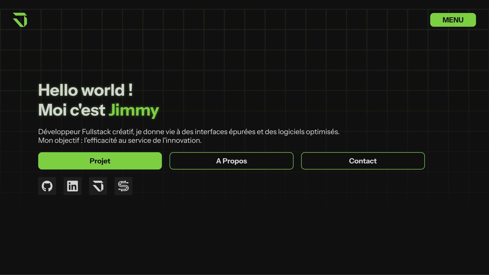

# 🧑‍💻 Portfolio

Portfolio personnel de **Jimmy Leschaeve**, développeur fullstack basé à Aix-en-Provence.

🔗 **[Voir le site en ligne](https://jimmyhub.fr)**




---

## 📋 À propos

Site portfolio présentant mes projets, mes compétences techniques et un moyen de me contacter. Conçu avec une approche interactive et des widgets dynamiques (météo, horloge, calendrier de contributions GitHub).

## ✨ Fonctionnalités

- **Design responsive** — Adapté à tous les écrans (mobile, tablette, desktop)
- **Carrousel de projets** — Navigation interactive avec support tactile, drag et clavier
- **Widgets dynamiques** — Horloge en temps réel, météo, calendrier de contributions GitHub
- **Formulaire de contact** — Envoi d'emails via Nodemailer avec rate limiting
- **Showcase technologies** — Présentation interactive du stack technique par catégorie
- **SEO optimisé** — Métadonnées, balises Open Graph, sitemap, données structurées
- **Déploiement continu** — Hébergé et déployé automatiquement sur Vercel

## 🛠️ Stack technique

| Catégorie | Technologie |
|-----------|------------|
| Framework | Next.js |
| Langage | TypeScript |
| Styles | SCSS |
| Data fetching | SWR |
| Emails | Nodemailer |
| Icônes | React Icons |
| Analytics | Vercel Analytics & Speed Insights |
| Hébergement | Vercel |

## 🚀 Installation

```bash
# Cloner le repo
git clone https://github.com/Leschaevej/Portfolio.git

# Accéder au dossier
cd Portfolio

# Installer les dépendances et lancer le serveur
npm start
```

## 🔧 Variables d'environnement

Créer un fichier `.env` à la racine du projet :

```env
MAIL_USER=         # Adresse email pour l'envoi
MAIL_PASSWORD=     # Mot de passe ou app password
GITHUB_TOKEN=      # Token GitHub pour l'API GraphQL
```

## 📄 Licence

Ce projet est sous licence [MIT](./LICENSE).
